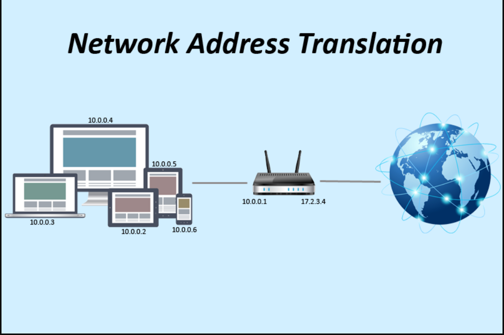

NAT
---
Network Address Translation (NAT) is the process where a network device, usually a firewall, assigns a public address to a computer (or group of computers) inside a private network. The main use of NAT is to limit the number of public IP addresses an organization or company must use, for both economy and security purposes.

The most common form of network translation involves a large private network using addresses in a private range (10.0.0.0 to 10.255.255.255, 172.16.0.0 to 172.31.255.255, or 192.168.0 0 to 192.168.255.255). The private addressing scheme works well for computers that only have to access resources inside the network, like workstations needing access to file servers and printers. Routers inside the private network can route traffic between private addresses with no trouble. However, to access resources outside the network, like the Internet, these computers have to have a public address in order for responses to their requests to return to them. This is where NAT comes into play.

A workstation inside a network makes a request to a computer on the Internet. Routers within the network recognize that the request is not for a resource inside the network, so they send the request to the firewall. The firewall sees the request from the computer with the internal IP. It then makes the same request to the Internet using its own public address, and returns the response from the Internet resource to the computer inside the private network.

Note:
From the perspective of the resource on the Internet, it is sending information to the address of the firewall. From the perspective of the workstation, it appears that communication is directly with the site on the Internet. When NAT is used in this way, all users inside the private network access the Internet have the same public IP address when they use the Internet. That means only one public addresses is needed for hundreds or even thousands of users.

Firewall
--------
A firewall is a security device that can be a software program or a dedicated network appliance. The main purpose of a firewall is to separate a secure area(like private networks) from a less secure area(internet) and to control communications between the two. Firewalls can perform a variety of other functions, but are chiefly responsible for controlling inbound and outbound communications on anything from a single machine to an entire network.

Software Firewalls
------------------
Software firewalls, also sometimes called personal firewalls, are designed to run on a single computer. These are most commonly used on home or small office computers that have broadband access, which tend to be left on all the time. A software firewall prevents unwanted access to the computer over a network connection by identifying and preventing communication over risky ports.

 For example, computers access Web pages over port 80 and use port 443 for secure Web communications. A home computer would expect to receive data over these ports. However, a software firewall would probably block any access from the Internet over port 421, over which it does not expect to receive data. Additionally, port 421 has been used by certain Trojans (a type of malware) in the past.
 
 A software firewall also allows certain programs on the user's computer to access the Internet, often by express permission of the user. Windows Update, antivirus software, and Microsoft Word are a few programs that a user might legitimately expect to access the Internet.However, a program called gator.exe that is attempting to access the Internet when it shouldn't be running might be reason for concern, so the user could decline access for this program.
 
 Note:One drawback to software firewalls is that they are software running on a personal computer operating system. If the underlying operating system is compromised, then the firewall can be compromised as well.
 
 Hardware Firewalls
 ------------------
 Hardware firewalls are more complex. They also have software components, but run either on a specially engineered network appliance or on an optimized server dedicated to the task of running the firewall. The operating system underlying a hardware firewall is as basic as possible and very difficult to attack. Since no other software runs on these machines, and configuration takes a little more thought than clicking on an "allow" prompt, they are difficult to compromise and tend to be extremely secure.
 
 A hardware firewall is placed between a network, such as a corporation, and a less secure area, such as the Internet. Firewalls also can separate more secure networks from less secure networks, such as one corporate location within a larger corporate structure.
 
 There are many different default configurations for firewall devices.Rules can be as simple as allowing port 80 traffic to flow through the firewall in both directions, or as complex as only allowing 1433 (SQL server) traffic from a specific IP address outside of the network through the firewall to a single IP address inside the network.
 
 Note:Firewalls are also used for Network Address Translation (NAT). This allows a network to use private IP addresses that are not routed over the Internet. 
 
Note:In addition to port and IP address rules, firewalls can have a wide variety of functionality. They can also act as caching servers, VPNs, routers, and more. Some examples of hardware firewalls are CheckPoint, Cisco PIX, SonicWall, Contivity from Nortel, and Linksys (for the home market). 

