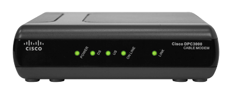

Difference between Router and Modem(Taken from Quora)?

Router
------
1)A router is a small box that joins two or more networks like the internet and a local network (see below).

	
While early routers provided several Ethernet ports for wired connections, most modern routers offer wirelessconnectivity as well. These "wireless routers" often have one or two moveable antennas on the sides, though some models house the antennas inside the enclosure. Wireless routers allow multiple computers and other devices, such as smartphone and tablets, to join the same network.

2)While connecting to a router provides access to a local network (LAN), it does not necessarily provide access to the Internet. In order for devices on the network to connect to the Internet, the router must be connected to a modem. Therefore, most routers have a specific Ethernet port that is designed to connect to the Ethernet port of a cable or DSLmodem.

Types of Routers
----------------

Broadband router
----------------
If you are using Voice over IP (VoIP) technology, then you will need a broadband router to connect your Internet to your phone. These are often a special type of modem that will have both Ethernet and phone jacks.

Wireless Routers
-----------------
Wireless routers connect to your modem and create a wireless signal in your home or office. So, any computer within range can connect to your wireless router and use your broadband Internet for free. The only way to keep anyone from connecting to your system is to secure your router.

Securing router
---------------
A word of warning about wireless routers: Be sure your secure them, or you will be susceptible to hackers and identity thieves. In order to secure your router, you simply need to come to WhatIsMyIPAddress.com, and get your IP address. Then, you'll type that into your web browser and log into your router (the user ID and password will come with your router).

Remember to change the router ID and password as well or someone else might lock you out of your system.

Modem(Modulator/Demodulator)
----------------------------
1)A modem is a device that provides access to the Internet (see below). 

2)The modem connects to your ISP, which typically provides either cable or DSL Internet service. 
	a) Cable modems have a coaxial (or "coax") connection, which is the same type of connector found on a TV or cable box. This connects to a cable port on the wall. 
	b) DSL(Digital Subscriber line) modems have a telephone connector, also called an RJ-11 jack, which connects to a telephone socket on the wall. 
3)By connecting your modem to your router (instead of directly to a computer), all devices connected to the router can access the modem, and therefore, the Internet. 
4)The router provides a local IP address to each connected device, but they will all have the same external IP address, which is assigned by your ISP.

To summarize, the device connection order is outlined below:

PC or wireless device 
Router 
Modem 
ISP 
Internet

While the router and modem are usually separate entities, in some cases, the modem and router may be combined into a single device. This type of hybrid device is sometimes offered by ISPs to simplify the setup process.
